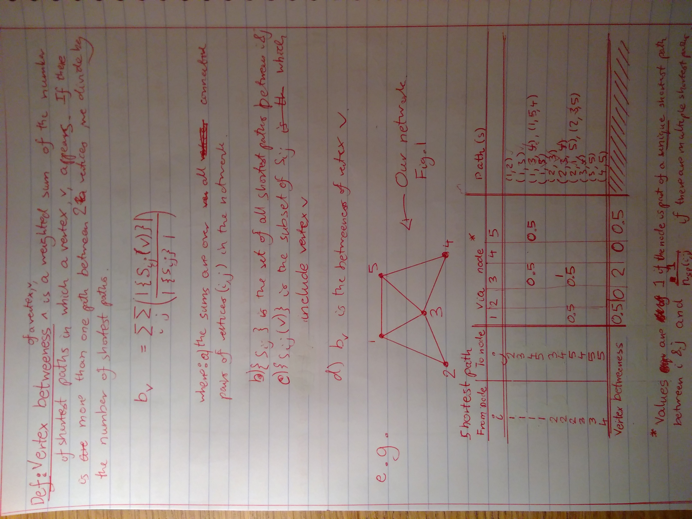
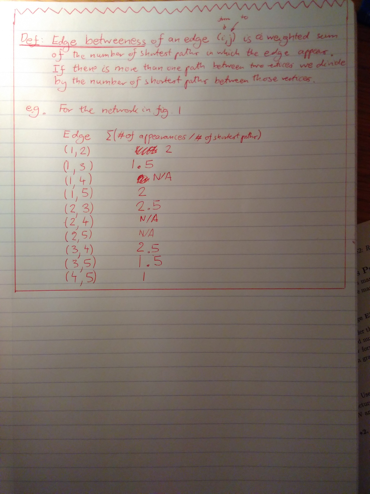

## Notes on Networks Course

### 2018-2-24: Betweeness Defined: 

Here are some notes on vertex and edge betweeness defined on Networks, based on the notes from the Networks course at the Physics department at Imperial College London. Credit due to Tim Evans.

EDIT 24-2-18: Apologies for the rotation - I will try to fix this, but for the meantime, please download as a [pdf here](betweeness.pdf)

