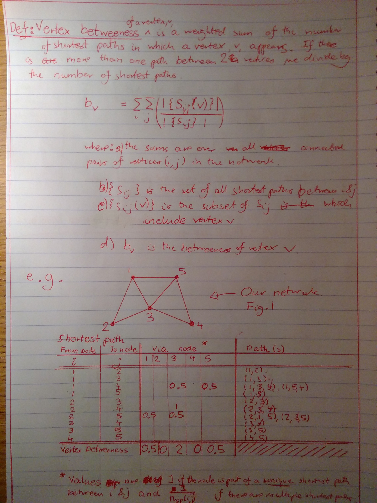

## Notes on Networks Course

### 2018-2-24: Betweeness Defined: 

Here are some notes on vertex and edge betweeness defined on Networks, based on the notes from the Networks course at the Physics department at Imperial College London. Credit due to Tim Evans.

